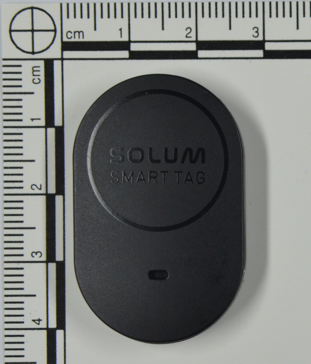

# Smart Tag Parser (S.TASER)

### DFRWS EU 2025 - Samsung Tracking Tag Application Forensics in Criminal Investigations

<br>


## 1. Samsung tracking tags

|  |  |  |
|----------------------------------------|----------------------------------------|----------------------------------------|
| Smart Tag | Smart Tag2|Solum Smart Tag|

<br>

## 2. Applications


|Name|Proposal version|Camera-ready version|etc.|
|---|---|---|---|
|SmartThings (ST)|1.8.18.21|1.8.21.28|Rooting detection adpoted |
|SmartThings Find (STF)|1.8.21.28|1.8.27-10||
|Samsung Find (SF)|1.3.12|1.4.00.10||

<br>


### * Applications' functions in the experiments


|  |  |  |   |   |   | 
|-----------------------|----------------------------------|---------------------|------------------------------------|--------------------|----------------------------------|
| Tag registration | Location data retrieval | Tag deletion | Location deletion | Account logout | Service withdrawal  |

<br>


## 3. Experimental scenarios and results


|No|Experiment type|Experiment summary|
|---|---|---|
|1|[Basic artifact structure](https://github.com/eininondumak/S.TASER/blob/main/Scenarios/1.md#1-artifact-structure)|Tag registration, location data retrieval|
|2|[Tracking tag registration](https://github.com/eininondumak/S.TASER/blob/main/Scenarios/2.md#2-tracking-tag-registraion)|Tag registration, deletion, re-registration and network packet collection|
|3|[Location data retrieval](https://github.com/eininondumak/S.TASER/blob/main/Scenarios/3.md#3-location-data-retrieval)|Location data retrieval through STF and SF, network packet collection|
|4|[Registered tracking tag deletion](https://github.com/eininondumak/S.TASER/blob/main/Scenarios/4.md#4-registered-tracking-tag-deletion)|Registered tag deletion through ST|
|5|[Location data deletion](https://github.com/eininondumak/S.TASER/blob/main/Scenarios/5.md#5-location-data-deletion)|Location data deletion through STF and SF|
|6|[Account logout](https://github.com/eininondumak/S.TASER/blob/main/Scenarios/6.md#6-account-logout)|Account logout through ST|
|7|[Service withdrawal](https://github.com/eininondumak/S.TASER/blob/main/Scenarios/7.md#7-service-withdrawal)|Withdrawing from the SmartThings service through ST|
|8|[Application synchronization](https://github.com/eininondumak/S.TASER/blob/main/Scenarios/8.md#8-application-synchronization)|Comparison of results after location data deletion and STF and SF synchronization in multi-device environment|

#### * The link of raw data is [here](https://drive.google.com/drive/folders/1urp38_Q--hbl450xpTpi4eGf80vsOpbZ?usp=drive_link)

<br>

## 4. Artifacts structure of the proposal version (ST: 1.8.18.21)


|Database (Table)|deviceId|mnId|setupId|modelName|logId(identifier)|timestamp|GeoInfo|
|---|---|---|---|---|---|---|---|
|DeviceData.db (DeviceDomain)|○|○|○|○|○|○|
|BackgroundDeviceData.db <br> (DeviceDomain)|○|○|○|○|○|○|
|DeviceData_core.db (DeviceDomain)|○|○|○|○|○|○|
|PersistentLogData.db (PersistentLogDomain)|○|○|○|○|○|○|
|Fme.db (FmeAppData)|○|○|||||○|
|DeviceCapabilityStatusData.db <br> (BleDeviceCapabilityStatusDomain)|○|||||||
|DeviceCapabilityStatus-<br>Data_core.db <br> (BleDeviceCapabilityStatusDomain)|○|||||||
|InternalSettings.db (insettings)|○|||||||
|EasySetupIconNameDb.db (EasySetupIconDb)|||○|○||○|
|FME_SELECTED_DEVICE.xml|○|○|||||○|
|cache Files|○||○|○||○||
|com.samsung.android.plugin-<br>platform.pluginbase-<br>.sdk.PluginSQLiteQpenHelper.-<br>[AppId].location_history  * Encrypted|○||||||○|
|app-database.db (item_history)|○||||||○|
|find-sdk (TagGeolocation) <br> * Encrypted|○||||||○|
* app-database.db and find-sdk are artifacts of SF, The others are artifacts of ST/STF

<br>

## 5. Tag registration

#### 1. Overview
During the tag registration process, various identification data is recorded in the application's database and web cache files.
In the previous study by Yu, T. et al. (2022)<sup>1</sup>, the API calls between the ST and the server during the tag registration process reveal various identification data such as the fixed unique identifier of the tag (logId).
Our study primarily focuses on identifying artifacts stored on the device. However, it also introduces APIs that provide clues for discovering identification data stored on the device, based on network data before and after the tag registration.

In actions 1 and 2 of the table below, the mnId and setupId values, which reveal the general model information of the tag, can be found. When a user registers the tag discovered, the application sends a query to the server to check whether the tag is already registered (action 3). At this stage, the logId can be identified. Once the tag registration is completed, the identification data of the registered tag is stored in the DataLayerData.db (action 4).

Finally, after the tag registration is complete, the tag's status is checked, and the tag is displayed on the application's screen. By utilizing the API information called at this stage, it is possible to infer the initial registration time of the tag (action 5).

|Order|Action|Identification data|Artifact|
|----|---|----|----|
|1|Search nearby tag|mnId, setupId|EasySetupIconNameDb.db|
|2|Obtain registration info|mnId, setupId|Cache|
|3|Check for duplicate logId|mnId, setupId, logId, modelName|Cache|
|4|Registration completion|deviceId, modelName, label, mnId, setupId, logId|DataLayerData.db|
|5|Information retrieval|deviceId|Cache|

#### 2. Network data 

* During the tag registration process, the server's APIs are called. The application contains cache files related to this process, and the tool explores the cache of API calls as shown in the table below to discover identification information. The step 3 and 4 are called after the tag is registered, to check the [status](https://developer.smartthings.com/docs/api/public#tag/Devices)<sup>2</sup> of the registered tag and [present](https://developer.smartthings.com/docs/api/public#tag/Presentations)<sup>2</sup> the tag on the application's screen.

|Order|Action|API|Identification data|
|----|---|----|----|
|1|Obtain registration info|api.smartthings.com/catalogs/api/v3/easysetup/setupdata|mnId, setupId|
|2|Check for duplicate logId|client.smartthings.com/chaser/trackers/lostmessage|mnId, setupId, logId, modelName|
|3|Information retrieval|client.smartthings.com/devices/status|deviceId|
|4|Information retrieval|client.smartthings.com/presentation|deviceId|  

\* captured network data files are in the Scenario 2 folder.

#### 3. Recovery of deleted tag information

In this study, the identification information of deleted tags is recovered as follows, and implemented in the tag_parser.py of S.TAGER.

The recovery process combines information that still exists after deletion, excluding carving data such as SQLite WAL carving.

1. Identification of the deleted Tag's deviceId
The deviceIds of all registered tags are stored in internalsettings.db, and remain even if the user deletes a tag. The deviceIds of live tags are found in DataLayerData.db. The presence of a deleted tag is determined by comparing the values between these databases (handled by the search_deletedTag function).

2. Recovery of deleted Tag Information
When a deleted deviceId is found, the 'get_tag_information' function attempts to recover it using the following methods:

* Check DataLayerData_core.db, which contains the same information as DataLayerData.db, to find the presence of the deleted deviceId.
* Search PersistentLogData.db to locate the deletion logs of the tag and recover the information.
* Finally, based on the deleted tag's deviceId, search for cache files relating APIs (client.smartthings.com/devices/status, client.smartthings.com/presentation) called immediately after the tag registration. Once the cache file is found, search for adjacent duplicate registration confirmation API call (client.smartthings.com/chaser/trackers/lostmessage) at the time the cache file was generated, to recover information such as logId.


#### 4. S.TASER results (Tag information analysis)

For each individual scenario, the tool checked whether the deviceIds of all registered tags could be identified from the last forensic image. In cases where a deleted deviceId was found, the tool attempted to recover identifier information such as the logId. The results are summarized in the table below.

|Experiment name|Raw data<br>Total deviceId (Deletion)|S.TASER<br>deviceId (Recover)|Source|
|----|---|----|----|
|Basic artifact structure|4 (0)|4 (0)|20241203-S1-default, s0-latest-white-second|
|Tracking tag registration|3 (1)|3 (1)|241201_S2_oneconnect-2|
|Location data retrieval|N/A|N/A||
|Registered tracking tag deletion|4 (2)|4 (2)|s4-5|
|Location data deletion|N/A|N/A||
|Account logout|4 (4)|4 (2)|s6-1|
|Service withdrawal|1 (1)|1 (1)|s7-2|
|Application synchronization|2 (1)|2 (1)|s8-device1-4|

<br>

#### 5. Changes after tag deletion 

* As tags are deleted, the identification information of the deleted tags is removed from DataLayerData.db, but the cache files that contain the API calls, as mentioned earlier, still exist.

* If a deleted tag is re-registered, the API is called again during the tag registration process, which results in a change in the creation time of the cache. As a result, it becomes difficult to find the information of the previously deleted tag.


* Additionally, in the case of account logout or service withdrawal, the cache files are deleted, making it impossible to find the information of the deleted tag.
  
<br>

## 6. Location data

The structure of the location information database for STF and SF is almost identical.
In the STF table structure, the location information is stored in the history column of the EncLocationHistory table in an encrypted format.

The STF was decompiled using JADX, and the code for decrypting the location information was identified as shown in the figure below.


#### * Location_history decryption pesudo-code

```
START

    // Step 1: Input
    encryptedText ← "Encrypted text in Base64"
    keyAlias ← "com.samsung.android.plugin.fme.storage"  // Key alias

    // Step 2: Base64 Decode
    decodedData ← Base64.decode(encryptedText)

    // Step 3: Retrieve Secret Key from Keystore
    decryptionKey ← GetKeyFromKeystore(keyAlias)

    // Step 4: Initialize Cipher for AES/GCM/NoPadding
    cipher ← Cipher.getInstance("AES/GCM/NoPadding")
    cipher.init(DECRYPT_MODE, decryptionKey, new GCMParameterSpec(128, decodedData, 0, 12))

    // Step 5: Perform Decryption
    decryptedData ← cipher.doFinal(decodedData, 12, decodedData.length - 12)

    // Step 6: Convert Decrypted Data to UTF-8 String
    decryptedText ← new String(decryptedData, Charset.forName("UTF-8"))

    // Step 7: Return Decrypted Text
    RETURN decryptedText

END
```
<br>

Accessing data stored in the Androidkeystore is very challenging. For this reason, in Scenario 3, the Frida script was used on a rooted device to dynamically decrypt the location information stored on the smartphone.

The history column stores location information in JSON format, and the important fields (timestamp, geolocation) are as shown in the table below.


#### * Key elements in history column 

|No|Key|Descripton|etc.|
|---|---|---|---|
|1|start|earlest time from clustered location data||
|2|end|latest time from clustered location data||
|3|count|the number of clustered location data||
|4|sumLatitude|Sum of latitude data||
|5|sumLongitude|Sum of longitude data||
|6|Latitude|Avg of latitude data||
|7|Longitude|Avg of longitude data||
|8|locations|Individual data of clustered location information|JSON format|

<br>

The location information in SF is stored in the item_history table, containing the same data as STF. However, the 'locations' key-values present in STF is not found in SF.

#### * Compare the location data from the apps with real-world GPS data

To verify the accuracy of the artifacts related to the tag's location information, GPS data was collected separately while the tags were in motion. The comparison of the location information analyzed in Scenarios 3 and 8 with GPS data from the same time periods is shown below. The analysis results accurately reflect the actual movement of the tags.

\* GPS data was collected every 2 seconds. The GPS data within 5 seconds before and after the timestamp of the analyzed location information was displayed on the map.

#### 1. Scenario 3

| | |
|---------------------------------------------------------|---------------------------------------------------------|
| * Blue: clustered (Avg.) tag location data, Green: GPS | * Blue: unclustered tag location data, Green: GPS|

<br>

| |
|---------------------------------------------------------|
| * Blue: clustered tag location data, Green: unclustered tag location data |


#### 2. Scenario 8


| |
|---------------------------------------------------------|
| * Blue: clustered tag location data, Green: GPS |


* Raw data is in the Scenario 3 folder.


#### 3. Network data 

In scenario 3, network data between the smartphone and the server was collected. The APIs requested by the application to the server during the tag registration and location information retrieval processes were identified as follows.

In the previous study by Yu, T. et al. (2022)<sup>1</sup>, an API for retrieving location information from ST/STF was made publicly available. This study also confirmed that the API endpoint has not changed. Additionally, this research further identified the API for retrieving location information from SF, as detailed below.

\* captured files are in the Scenario 3 folder.


|Application| ST/STF | SF |
|---------|---------|-----|
|Host|api.smartthings.com |api.samsungfind.com|
|API| POST /installedapps/[AppId]/execute HTTP/1.1 | GET /tag/devices/[Tag's deviceId]/geolocations HTTP/1.1|
|Detail|| |


# References

1. Yu, T., Henderson, J., Tiu, A. and Haines, T., 2022. Privacy Analysis of Samsung’s Crowd-Sourced Bluetooth Location Tracking System. arXiv preprint. 2210.14702. viewed 29 September 2024. <https://arxiv.org/abs/2210.14702>.
2. SmartThings Developers, SmartThings API (1.0-PREVIEW), viewed 13 December 2024. <https://developer.smartthings.com/docs/api/public>.


